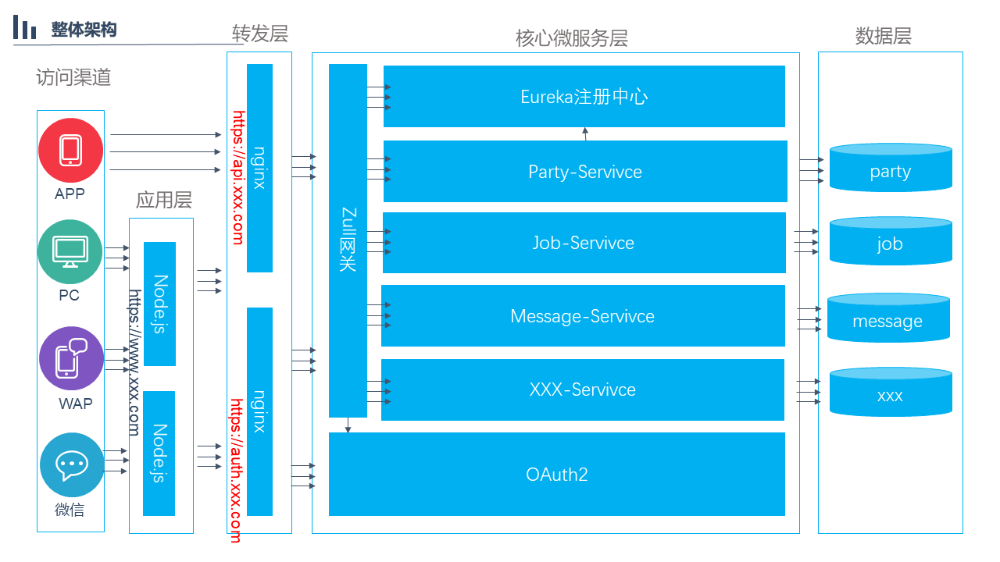

### 项目概述
项目基于SpringCloud技术栈，封装实现了搭建企业级应用的最佳实践，可以作为项目开发的脚手架使用，不用每次从头搭建，该项目事项了前后台分离技术进行开发，后台只提供rest接口，前端可以根据实际的需要采用reactjs/angular/vue或其他开发技术进行接口对接。
### 开发技术
|名称|版本|描述
|:-|:-|:-
|JDK|1.8|正确设置JAVA_HOME、CLASSPATH、PATH变量
|Maven|3.5.2|正确设置M2_HOME变量，把mvn加入到PATH下
|MySQL|5.7|
|Spring Boot|2.0.2.RELEASE|oauth2项目中使用的是1.5.12.RELEASE，因为2.x版本与某个class不兼容
|Spring Cloud|Edgware.SR3
|mybatis|3.4.6|使用mybatis-spring框架封装通用操作
|swagger2|3.8.0|基于注解生成API文档
|lombok|1.16.0|自动生成getter/setter/toString等方法
|guava|18.0|

### 系统架构

### 系统模块

### 项目初始化

### 运行项目
