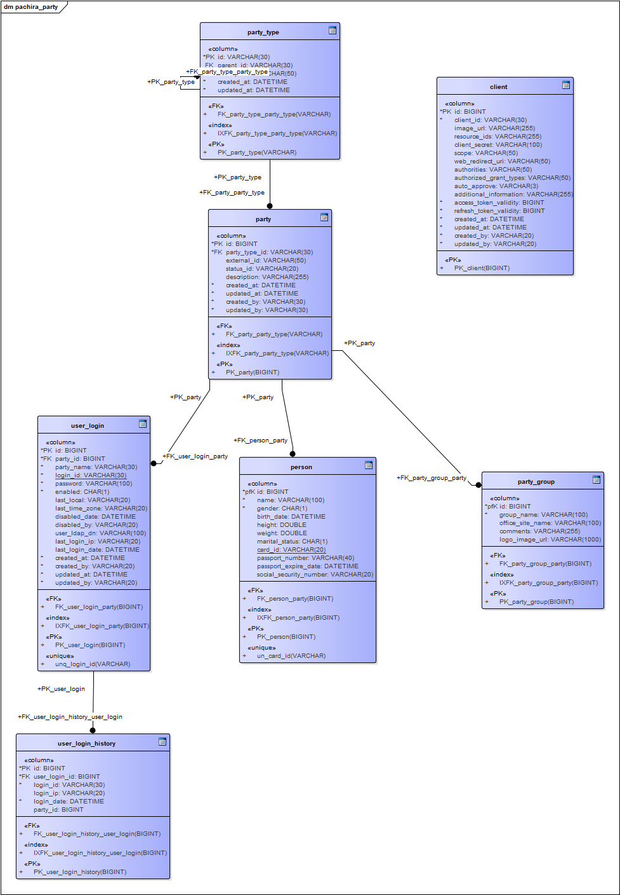

## 1.整体架构
### 1.1.项目概述
项目基于SpringCloud技术栈，封装实现了搭建企业级应用的最佳实践，可以作为项目开发的脚手架使用，不用每次从头搭建，该项目事项了前后台分离技术进行开发，后台只提供rest接口，前端可以根据实际的需要采用reactjs/angular/vue或其他开发技术进行接口对接。
### 1.2.开发技术
|名称|版本|描述
|:-|:-|:-
|JDK|1.8|正确设置JAVA_HOME、CLASSPATH、PATH变量
|Maven|3.5.2|正确设置M2_HOME变量，把mvn加入到PATH下
|MySQL|5.7|
|Spring Boot|2.0.4.RELEASE|
|Spring Cloud|Finchley.SR1
|mybatis|3.4.6|使用mybatis-spring框架封装通用操作
|swagger2|2.9.2|基于注解生成API文档
|lombok|1.16.22|自动生成getter/setter/toString等方法
|guava|26.0-jre|

### 1.3.系统架构


微服务之间的通信：
- xxx-client模块中提供本模块对外暴漏的api接口和api中使用的参数entity,dto等
- xxx-server模块提供对接口的实现
- 模块之间通过feign实现接口调用
- 服务启动成功后把自身注册到consul注册中心
- 示例：
    - 外部接口定义，位于[party-client](pachira-party-client/pachira-party-client)模块中的[UserApi.java](pachira-party/pachira-party-client/src/main/java/com/pachiraframework/party/api/UserApi.java)
        ```
        package com.pachiraframework.party.api;
        
        import org.springframework.http.MediaType;
        import org.springframework.http.ResponseEntity;
        import org.springframework.web.bind.annotation.PathVariable;
        import org.springframework.web.bind.annotation.RequestBody;
        import org.springframework.web.bind.annotation.RequestMapping;
        import org.springframework.web.bind.annotation.RequestMethod;
        import org.springframework.web.bind.annotation.RequestParam;
        
        import com.pachiraframework.common.ExecuteResult;
        import com.pachiraframework.party.dto.CreateUserLoginHistoryDto;
        import com.pachiraframework.party.entity.UserLogin;
        import com.pachiraframework.party.entity.UserLoginHistory;
        
        import io.swagger.annotations.ApiImplicitParam;
        import io.swagger.annotations.ApiOperation;
        import io.swagger.annotations.ApiParam;
        
        /**
         * @author Kevin Wang
         *
         */
        @RequestMapping("/v1/party")
        public interface UserApi {
        	@ApiOperation(value = "根据用户ID获取用户信息", notes = "根据url的id来获取用户详细信息")
        	@ApiImplicitParam(name = "userId", value = "用户ID", required = true, dataType = "Long",example="1")
        	@RequestMapping(value = "/users/{userId}", method = RequestMethod.GET)
        	public ResponseEntity<ExecuteResult<UserLogin>> getUser(@PathVariable("userId") Long userId);
        	
        	@ApiOperation(value = "根据用户登录帐号获取用户信息", notes = "根据登录帐号来获取用户详细信息")
        	@ApiImplicitParam(name = "loginId", value = "用户登录帐号", required = true, dataType = "String",example="admin")
        	@RequestMapping(value = "/users/", method = RequestMethod.GET)
        	public ResponseEntity<ExecuteResult<UserLogin>> getUser(@RequestParam(name="loginId") String loginId);
        	
        	@ApiOperation(value = "保存用户登录历史记录", notes = "根据登录帐号来获取用户详细信息",consumes= MediaType.APPLICATION_JSON_VALUE)
        	@RequestMapping(value = "/users/login_history", method = RequestMethod.POST)
        	public ResponseEntity<ExecuteResult<UserLoginHistory>> loginHistory(@ApiParam(name = "loginDto", value = "登录记录", required = true) @RequestBody CreateUserLoginHistoryDto loginDto);
        }
        
        ```
    - 接口实现，位于[pachira-party-server](pachira-party-client/pachira-party-server)模块的[UserController.java](pachira-party-server/src/main/java/com/pachiraframework/party/controller/UserController.java)
        ```java
        package com.pachiraframework.party.controller;
        
        import java.util.Optional;
        
        import org.springframework.beans.factory.annotation.Autowired;
        import org.springframework.http.HttpStatus;
        import org.springframework.http.ResponseEntity;
        import org.springframework.web.bind.annotation.RequestBody;
        import org.springframework.web.bind.annotation.RestController;
        
        import com.pachiraframework.common.ExecuteResult;
        import com.pachiraframework.party.api.UserApi;
        import com.pachiraframework.party.dto.CreateUserLoginHistoryDto;
        import com.pachiraframework.party.entity.UserLogin;
        import com.pachiraframework.party.entity.UserLoginHistory;
        import com.pachiraframework.party.service.UserLoginService;
        
        /**
         * 用户相关方法
         * 
         * @author KevinWang
         *
         */
        @RestController
        public class UserController extends AbstractPartyController implements UserApi{
        	@Autowired
        	private UserLoginService userService;
        	@Override
        	public ResponseEntity<ExecuteResult<UserLogin>> getUser(Long userId) {
        		return Optional.ofNullable(userService.get(userId)).map(result -> new ResponseEntity<>(result, HttpStatus.OK))
        				.orElse(new ResponseEntity<>(HttpStatus.NOT_FOUND));
        	}
        	
        	@Override
        	public ResponseEntity<ExecuteResult<UserLogin>> getUser(String loginId) {
        		return Optional.ofNullable(userService.get(loginId)).map(result -> new ResponseEntity<>(result, HttpStatus.OK))
        				.orElse(new ResponseEntity<>(HttpStatus.NOT_FOUND));
        	}
        	
        	@Override
        	public ResponseEntity<ExecuteResult<UserLoginHistory>> loginHistory(@RequestBody CreateUserLoginHistoryDto loginDto) {
        		return Optional.ofNullable(userService.createLoginHistory(loginDto)).map(result -> new ResponseEntity<>(result, HttpStatus.OK))
        				.orElse(new ResponseEntity<>(HttpStatus.NOT_FOUND));
        	}
        }
        
        ```
        **注意** 对于接口中定义了@RequestBody标签的参数，除了在Api接口中进行声明外，在实现接口的方法参数中还需要再声明一次，否则会导致该标签失效，示例见上面的 loginHistory方法。
    - 外部模块调用，位于[pachira-oauth2](pachira-oauth2)模块的[UserClient.java](pachira-oauth2/src/main/java/com/pachiraframework/oauth2/feign/UserClient.java)中
        ```
        package com.pachiraframework.oauth2.feign;
        
        import org.springframework.cloud.openfeign.FeignClient;
        
        import com.pachiraframework.oauth2.Services;
        import com.pachiraframework.party.api.UserApi;
        
        /**
         * @author wangxuzheng
         *
         */
        @FeignClient(name=Services.PARTY)
        public interface UserClient extends UserApi{
        }
        ```
        其中@FeignClient(name=Server.PARTY) name的取值为pachira-party模块注册到consul注册中心中的名字
### 1.4.系统模块
|模块名|模块说明|备注
|:-|:-|:-
|pachira-party|用户、权限、组织、客户端应用（client）管理功能|
|pachira-oauth2|基于Spring Cloud OAuth2实现的Oauth2服务端|调用pachira-party模块中的用户、client信息实现身份认证
|pachira-scheduler|基于quartz,zookeeper实现的分布式任务调度框架|支持手动编辑任务/多个节点自动分配


### 1.5.项目初始化
- 确保Eclipse正确安装配置了[lombok](https://www.projectlombok.org/download)插件，并按照[配置步骤](https://www.projectlombok.org/setup/eclipse)进行设置(**推荐在所有项目中使用lombok**)
- 将项目导入到eclipse或idea工作区中，并执行如下命令
    > mvn clean compile
   
    因为项目引入了一个外部的jar包，通过mvn clean 命令会触发工程中配置的*maven-install-plugin*插件将该jar包ynstall到本地仓库中
    ```
	<plugin>
		<groupId>org.apache.maven.plugins</groupId>
		<artifactId>maven-install-plugin</artifactId>
		<executions>
			<execution>
				<id>install-external</id>
				<phase>clean</phase>
				<configuration>
					<file>${basedir}/lib/pachiraframework-core-0.2.11.jar</file>
					<repositoryLayout>default</repositoryLayout>
					<groupId>com.pachiraframework</groupId>
					<artifactId>pachiraframework-core</artifactId>
					<version>0.2.11</version>
					<packaging>jar</packaging>
					<generatePom>true</generatePom>
				</configuration>
				<goals>
					<goal>install-file</goal>
				</goals>
			</execution>
		</executions>
	</plugin>
    ```
- 将数据库脚本导入到数据库中(脚本的名字即对应的数据库名)
    - pachira-scheduler任务调度服务模块的脚本[pachira_scheduler.sql](etc/sql/pachira_scheduler.sql) 
    - pachira-party用户权限管理模块的脚本[pachira_party.sql](etc/sql/pahira_party.sql)
- 修改程序连接的数据库地址及用户名密码
    - pachira-scheduler模块中的[application.properties](pachira-scheduler/src/main/resources/application.properties)文件
    - pachiar-party模块中的[MybatisConfig.java](pachira-party/pachira-party-server/src/main/java/com/pachiraframework/party/config/MybatisConfig.java)文件
- 启动consul服务注册中心
	- 下载consul最新版本[consul_1.2.2_windows_amd64](https://releases.hashicorp.com/consul/1.2.2/consul_1.2.2_windows_amd64.zip)
	- 解压到任意目录
	- 启动 consul agent -server -ui -dev -datacenter=qd
	    
	- 访问consul控制台 [http://127.0.0.1:8500/ui](http://127.0.0.1:8500/ui)
	    
### 1.6.运行项目
按照如下步骤和地址启动并验证微服务的启动
- pachira-scheduler模块
    - 启动类[com.pachiraframework.scheduler.SchedulerApplication](pachira-scheduler/src/main/java/com/pachiraframework/scheduler/SchedulerApplication.java)
    - 访问链接 [http://localhost:8082/job/search](http://localhost:8082/job/search)
- pachiar-party模块
    - 启动类[com.pachiraframework.party.PachiraPartyApplication](pachira-party/pachira-party-server/src/main/java/com/pachiraframework/party/PachiraPartyApplication.java)
    - 访问链接 [http://localhost:8080/v1/party/1](http://localhost:8080/v1/party/1)
- pachira-oauth2模块
    - 启动类 [com.pachiraframework.oauth2.PachiraOauth2Application](pachira-oauth2/src/main/java/com/pachiraframework/oauth2/PachiraOauth2Application.java) 
    - 访问链接(POST请求) [http://localhost:8081/oauth/token?username=admin&password=123456&grant_type=password&scope=app&client_id=app1&client_secret=aaaaaaaa](http://localhost:8081/oauth/token?username=admin&password=123456&grant_type=password&scope=app&client_id=app1&client_secret=aaaaaaaa)
## 2.pachira-party模块架构设计
### 2.1 模块定位
该模块负责微服务框架中关于人员组织架构以及用户登录、权限控制模块的管理。
### 2.2 核心模型
|模型名称|中文|备注|
|:-|:-|:-
|Party|团体|可以是人员，也可以是组织|
|Person|人员|团体的一个具体形式，描述现实世界中关于人的属性
|PartyGroup|组织|团体的另一个具体形式，可以是一个团队、一个家庭，某个公司、或政府部门
|UserLogin|用户登录帐号|登录帐号密码的组合体，帐号可以是属于某个Person人员，也可以是某个PartyGroup组织
|UserLoginHistory|用户登录历史|登录的历史记录表
|PartyType|团体类型|用于描述系统中的团体类型，类型有父子结构
|Client|OAuth2接入客户端信息|使用OAuth2必须分配一个client接入方应用相关的信息

目前系统中已经提供的PartyType(团体类型)如下

### 2.3 数据库设计

## 3.pachira-oauth2模块架构设计
待完善
## 4.pachira-scheduler模块架构设计
待完善
## 5.pachira-message模块架构设计
待完善